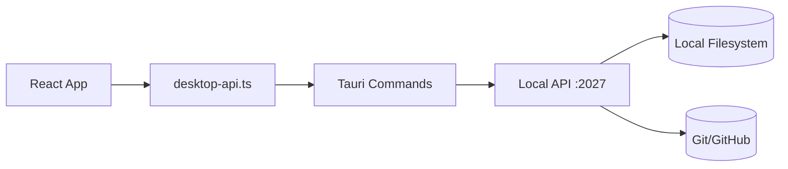

# SKT Skill Agent (Desktop)

面向 Skill 市场、安装管理、发布流程的一体化桌面应用。  
当前实现基于 `React + TypeScript + Vite + Tauri`，通过 Tauri Bridge 调用本地 API（默认 `127.0.0.1:2027`）完成业务操作。

## 1. 核心能力

- 市场管理（Market）
  - 仓库源筛选、索引同步、技能检索/排序、技能安装。
  - 支持源状态展示与源管理（新增/编辑/启停/删除/可达性检查）。
- 本地 Skill 管理（Local Skill Management）
  - 本地列表按 `Claude` 与 `Codex` 安装并集聚合展示。
  - 每个 Skill 显示双 Provider 标签：高亮=已安装，置灰=未安装。
  - 支持一键在 Claude/Codex 间安装同步、移除记录、从磁盘扫描。
- Skill 创造营（Skill Camp）
  - 预留页（当前为占位实现）。
- 发布中心（Release Center）
  - 单 Skill 发布流程：选择目录 -> 预检 -> 创建发布 PR。
  - 支持本机目录选择与手动路径；版本号默认自动生成；Skill ID 自动推导。
  - 预检与创建 PR 均带进行中动画与禁重入保护。

## 2. 技术栈

- 前端：`React 18`、`TypeScript 5`、`Vite 6`
- 桌面容器：`Tauri 2`
- Tauri 侧：`Rust + reqwest + rfd`
- 本地 API（开发态）：Node.js 脚本服务（`scripts/dev-local-api.mjs`）

## 3. 架构概览



- UI 层通过 `window.__TAURI__.core.invoke` 调用命令。
- Tauri 命令层负责参数校验、错误归一化、超时控制、目录选择器等桌面能力。
- Local API 层负责市场索引、安装记录、发布预检与 PR 创建。

## 4. 快速开始

### 4.1 环境要求

- Node.js `>= 18`
- pnpm
- Rust Toolchain（Tauri 运行需要）
- macOS/Linux 下可用的 `git`、`curl`、`lsof`

### 4.2 安装依赖

```bash
pnpm install
```

### 4.3 推荐启动方式（一键桌面联调）

```bash
pnpm start:stack
```

该命令会：

- 启动本地 API（默认 `127.0.0.1:2027`）
- 启动桌面前端（默认 `127.0.0.1:1420` + Tauri）
- 自动做端口清理与健康检查

停止：

```bash
pnpm stop:stack
```

### 4.4 仅前端开发

```bash
pnpm dev
```

### 4.5 打包构建

```bash
pnpm build
pnpm tauri:build
```

### 4.6 全平台安装包

项目已启用 Tauri 安装包构建（`src-tauri/tauri.conf.json` 中 `bundle.active=true`）。

- 本机执行 `pnpm tauri:build` 会产出当前操作系统安装包。
- CI 工作流 [`desktop-cross-platform-build`](./.github/workflows/desktop-cross-platform-build.yml) 会在 `macOS / Windows / Linux` 三个平台构建并上传安装包产物。
- 触发方式：
  - 手动触发：GitHub Actions `workflow_dispatch`
  - 发布触发：推送 tag（如 `v1.0.0`）

## 5. 常用命令

- `pnpm dev`：前端开发服务器
- `pnpm build`：TS + Vite 构建
- `pnpm tauri:dev`：Tauri 开发模式
- `pnpm start:stack`：启动本地 API + 桌面端联调栈
- `pnpm stop:stack`：停止联调栈
- `node scripts/run-test-suite.mjs`：执行项目检查集合

## 6. 关键环境变量

桌面联调脚本（`start-desktop-stack.sh`）：

- `API_HOST`/`API_PORT`（默认 `127.0.0.1:2027`）
- `DESKTOP_HOST`/`DESKTOP_PORT`（默认 `127.0.0.1:1420`）
- `BACKEND_CMD`（默认本地 API 脚本）
- `DESKTOP_CMD`（默认 `pnpm tauri dev`）

发布相关：

- `SKT_LOCAL_API_BASE`：Tauri 到本地 API 的基地址（默认 `http://127.0.0.1:2027`）
- `SKT_GITHUB_TOKEN` / `GITHUB_TOKEN` / `GH_TOKEN`：发布 PR 鉴权
- `SKT_RELEASE_REPO_URL` / `SKT_RELEASE_REPO_BRANCH`：发布目标仓库与分支

## 7. 测试与治理

- 本地检查：`tests/*.check.mjs`
  - 工程结构、启动脚本、桌面桥接、发布流程、离线策略、生命周期策略等。
- CI 工作流：`.github/workflows/*`
  - `beta-release` / `promote-stable` 审批约束
  - 合并后自动更新渠道指针与审计文件
  - 跨平台安装包构建与产物上传（`desktop-cross-platform-build.yml`）

## 8. 目录结构

```text
src/                 React 前端
src/components/      核心业务组件（源管理、发布面板等）
src/pages/           页面级容器
src/lib/desktop-api.ts  Tauri Bridge 调用封装
src-tauri/           Tauri + Rust 命令层
scripts/             启停脚本、Mock Local API、校验脚本
tests/               项目检查脚本
docs/                项目文档
```

## 9. 相关文档

- 全局技术方案：[docs/technical-solution.md](./docs/technical-solution.md)
- 桌面栈启动说明：[docs/desktop-stack-startup.md](./docs/desktop-stack-startup.md)
- 角色职责说明：[docs/operator-roles.md](./docs/operator-roles.md)
