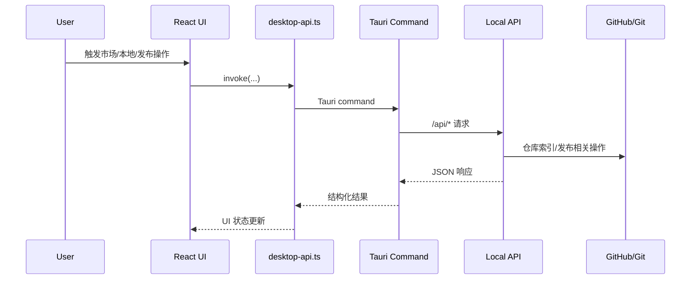

# SkillDock (Desktop)

SkillDock 是一个桌面端 Skill 工作台，覆盖 Skill 市场浏览安装、本地 Skill 聚合管理、以及单 Skill 发布流程。

## 页面预览

以下三块是当前主流程页面（对应你提供的 UI 截图）：

### 市场页面（Market）

指标卡片、搜索/排序/筛选、技能卡片浏览与安装。


### 本地 Skill 管理页面（Local Skills）

按 Provider 聚合、跨 Provider 安装/移除、详情查看。


### Skill 发布页面（Release Center）

三阶段发布流（准备信息 -> 预检清单 -> 创建发布 PR）。


## Features

- **Market Browse**：技能市场浏览、同步索引、筛选与安装
- **Source Management**：仓库源新增/编辑/启用/禁用/删除、可达性检查
- **Local Skill Hub**：本地 Skill 扫描聚合（Claude / Codex / Cursor）
- **Cross-provider Actions**：按 Provider 一键安装或移除
- **Release Flow**：单 Skill 预检 dry-run 与创建 PR
- **Desktop Native**：目录选择、桌面命令桥接、统一错误处理
- **Bilingual UI**：中英文切换与本地持久化

## Project Structure

```text
SKT/
├── src/                    # Frontend (React + TypeScript)
│   ├── app/                # 应用壳与样式
│   ├── pages/              # 市场 / 本地 / 创造营 / 发布中心
│   ├── components/         # 复用组件（源管理、发布面板等）
│   └── lib/desktop-api.ts  # 前端到 Tauri 命令桥接
├── src-tauri/              # Desktop App (Tauri 2 + Rust)
│   └── src/commands/       # Tauri command -> Local API 路由
├── scripts/
│   ├── dev-local-api.mjs   # 本地 API 服务（Node HTTP）
│   ├── start-desktop-stack.sh
│   └── stop-desktop-stack.sh
├── src-api/                # 领域模块与方案沉淀（当前默认启动链路未直接挂载）
└── docs/                   # 技术方案与流程文档
```

## Tech Stack

| Layer | Technologies |
| --- | --- |
| Frontend | React 18, TypeScript, Vite |
| Desktop | Tauri 2, Rust (`tauri`, `reqwest`, `serde`) |
| Local API | Node.js HTTP server (`scripts/dev-local-api.mjs`) |
| Runtime Data | `.runtime/desktop-stack/local-api/*.json` |

## Architecture

SkillDock 采用四层调用链：

1. React 页面层（`src/pages/*`）
2. 前端桥接层（`src/lib/desktop-api.ts`）
3. Tauri 命令层（`src-tauri/src/commands/desktop.rs`）
4. Local API 服务层（`scripts/dev-local-api.mjs`）



## Technical Solution

### 1) 目标与边界

- 目标：在桌面端形成 `市场发现 -> 本地管理 -> 发布预检/创建PR` 的闭环工作流
- 目标：统一跨 Provider（Claude/Codex/Cursor）的 Skill 聚合与操作体验
- 目标：把发布过程显式化（阶段轨道、dry-run、变更预览、可审计）
- 非目标：当前不做 Skill 创造营的完整生产能力（该页为占位/演进中）
- 非目标：前端不直连远端仓库 API，统一经 Tauri + Local API 访问

### 2) 分层职责

| Layer | 主要文件 | 职责 |
| --- | --- | --- |
| UI Layer | `src/pages/*`, `src/components/*` | 交互编排、状态展示、国际化、页面流程 |
| Bridge Layer | `src/lib/desktop-api.ts` | 统一封装 `invoke`、错误归一化、前端 API 适配 |
| Desktop Command Layer | `src-tauri/src/commands/desktop.rs` | 参数透传、超时控制、命令路由、系统能力（目录选择） |
| Local API Layer | `scripts/dev-local-api.mjs` | 源管理、市场索引、安装记录、本地扫描、发布 dry-run/PR |
| Persistence Layer | `.runtime/desktop-stack/local-api/*.json` | sources/installations/general-settings 本地状态持久化 |

### 3) 核心流程模块

- 市场（Market）
- 源管理（Source Manager）
- 本地 Skill 管理（Local Skills）
- 发布中心（Release Center）

### 4) 命令与接口映射（核心）

| Frontend/Tauri Command | Local API Route | 用途 |
| --- | --- | --- |
| `list_repo_sources` | `GET /api/settings/skills/sources` | 获取仓库源列表 |
| `upsert_repo_source` | `PUT /api/settings/skills/sources` | 新增/更新仓库源 |
| `delete_repo_source` | `DELETE /api/settings/skills/sources` | 删除仓库源 |
| `sync_market_index` | `POST /api/market/sync` | 同步市场索引 |
| `get_market_skills` | `POST /api/market/skills` | 获取市场技能 |
| `install_market_skill` | `POST /api/market/install` | 安装市场技能 |
| `list_local_skills` | `GET /api/local/skills` | 获取本地技能记录 |
| `scan_local_skills_from_disk` | `POST /api/local/skills/scan` | 扫描本地技能目录 |
| `install_local_skill_for_provider` | `POST /api/local/skills/provider/install` | 跨 Provider 安装 |
| `remove_local_skill_record` | `DELETE /api/local/skills` | 移除本地技能记录 |
| `dry_run_beta_release` | `POST /api/release/beta/dry-run` | 发布前预检 |
| `create_beta_release_pr` | `POST /api/release/beta/create-pr` | 创建 beta 发布 PR |

### 5) 本地数据与目录约定

- 状态文件：
- `.runtime/desktop-stack/local-api/sources.json`
- `.runtime/desktop-stack/local-api/installations.json`
- `.runtime/desktop-stack/local-api/general-settings.json`
- 默认本地扫描目录：
- `~/.codex/skills` -> `local-codex`
- `~/.claude/skills` -> `local-claude`
- `~/.cursor/skills` -> `local-cursor`
- 默认发布仓库配置可由通用设置覆盖（团队仓库 URL）

### 6) 发布流程与治理

- 阶段流：
- 阶段 1 准备：选择 Skill 路径、填写版本、自动推导 skillId
- 阶段 2 预检：执行 dry-run，生成变更清单与检查项
- 阶段 3 发布：创建发布 PR
- 治理角色（详见 `docs/operator-roles.md`）：
- Author：实现与提交 beta 变更
- Skill Owner：发起稳定发布决策
- Supervisor：关键门禁审批

### 7) 错误模型与交互约束

- 前后端统一 `GuardedError` 分类：
- `OFFLINE_BLOCKED`
- `OWNER_ONLY`
- `SUPERVISOR_APPROVAL_REQUIRED`
- `UNREACHABLE_SOURCE`
- `NETWORK_ERROR`
- `VALIDATION_ERROR`
- `UNKNOWN`
- UI 关键约束：
- 详情弹框通过 portal 到 `document.body`，避免缩放容器下定位偏移
- 桌面窗口最小尺寸 `980x700`，降低布局溢出风险

## Core Pages

### 1) 市场页面（Market）

- 指标概览：已启用源 / 生效筛选源 / 可见技能
- Tab：`技能浏览` 与 `源管理`
- 能力：同步市场索引、搜索、排序、按源过滤、技能安装
- 详情弹框：展示技能解释、版本、来源、安装操作

### 2) 本地 Skill 管理页面（Local Skills）

- 顶部 Provider 过滤：全部 + Claude/Codex/Cursor 图标计数
- 能力：加载本机已安装 Skill、刷新、搜索
- 卡片能力：Provider 状态切换（装/卸）、详情查看、记录移除
- 详情弹框：路径、分支、安装时间等信息

### 3) 发布页面（Release Center）

- 三阶段发布轨道：准备信息 -> 预检清单 -> 创建发布 PR
- 阶段切换：上一步/下一步
- 发布标识：版本号 + 自动技能 ID
- 能力：dry-run 预检、变更预览、创建 PR

## Development

### Requirements

- Node.js >= 18
- pnpm
- Rust toolchain (`rustc` / `cargo`)

### Quick Start (Recommended)

```bash
pnpm install
pnpm start:stack
```

该命令会自动启动：

- Local API: `127.0.0.1:2027`
- Desktop Web: `127.0.0.1:1420`
- Tauri Desktop App

停止：

```bash
pnpm stop:stack
```

### Manual Start

```bash
# terminal A
pnpm dev:api

# terminal B
pnpm dev:app
```

## NPM Scripts

| Command | Description |
| --- | --- |
| `pnpm dev` | 启动前端 Vite 开发服务 |
| `pnpm dev:api` | 启动本地 API |
| `pnpm dev:app` | 启动 Tauri 桌面应用 |
| `pnpm build` | TS + 前端构建 |
| `pnpm tauri:build` | 打包桌面应用 |
| `pnpm start:stack` | 一键启动整套桌面联调栈 |
| `pnpm stop:stack` | 停止整套联调栈 |

## Runtime Notes

- 桌面窗口最小尺寸：`980 x 700`（`src-tauri/tauri.conf.json`）
- 详情弹框（市场 / 本地 / 源管理）通过 `portal` 挂载到 `document.body`，保证在当前窗口视口内居中显示
- 发布页为稳定布局，避免常规窗口尺寸下关键操作区溢出

## Troubleshooting

```bash
# 查看日志
tail -n 120 .runtime/desktop-stack/logs/backend.log
tail -n 120 .runtime/desktop-stack/logs/desktop.log

# 健康检查
curl -fsS http://127.0.0.1:2027/api/health
curl -fsS http://127.0.0.1:1420
```
