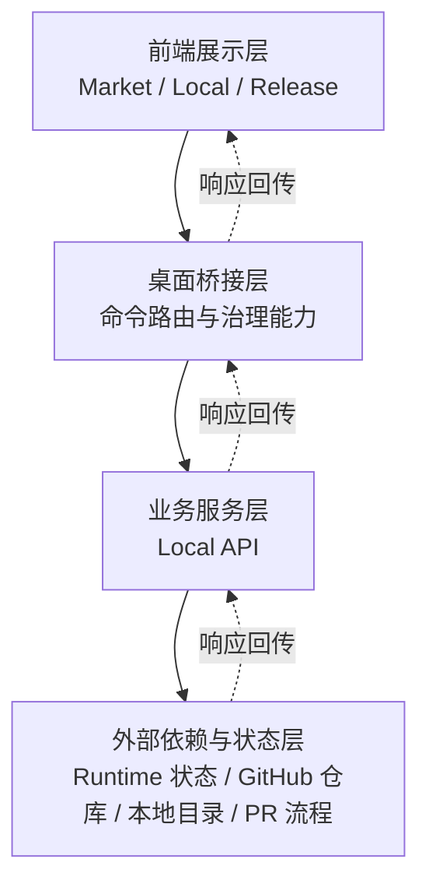

# SkillDock 技术报告（基于当前代码实现）

更新时间：2026-03-09  
结论口径：**仅基于代码与可执行结果**（未使用 README 与既有技术方案文档作为判断依据）

## 1. 执行摘要

SkillDock 当前是一个桌面端 Skill 工作台，已形成可运行的四层链路：

1. React 前端页面层（市场 / 本地管理 / 发布中心 / 创造营〔规划模块，占位态〕）
2. `desktop-api.ts` 前端桥接层（统一 `invoke` 与错误归一）
3. Tauri Rust 命令层（参数校验、超时、路由到 Local API）
4. Node Local API 层（源管理、市场索引、安装记录、本地扫描、beta 发布）

当前版本的关键状态：

- 市场浏览、源管理、本地技能聚合、beta 发布 dry-run/创建 PR 已闭环。
- 发布链路具备离线阻断、Owner/Supervisor 治理规则与 GitHub Actions 门禁。
- UI 最近完成了布局稳定性治理：弹框通过 portal 居中、发布页防溢出、窗口最小尺寸约束（`980 x 700`）。
- `src-api` 已沉淀较完整的领域模块（install/publish/lifecycle/promotion），但默认桌面启动链路目前主要走 `scripts/dev-local-api.mjs`，两套实现存在并行状态。

## 2. 技术栈与工程形态

## 2.1 前后端栈

- 前端：React 18 + TypeScript + Vite
- 桌面壳：Tauri 2 + Rust（`tauri` / `reqwest` / `serde` / `rfd`）
- 本地服务：Node HTTP（`scripts/dev-local-api.mjs`）
- 构建命令：`pnpm build`（`tsc && vite build`）

## 2.2 运行端口与最小窗口

- 前端开发服务：`127.0.0.1:1420`
- Local API：`127.0.0.1:2027`
- Tauri 窗口最小尺寸：`minWidth: 980`, `minHeight: 700`

## 3. 总体架构与调用链

![SkillDock 系统架构概览（精简）]

## 3.1 前端分层

- 应用壳：`src/app/app.tsx`
- 页面：
  - `src/pages/market-page.tsx`
  - `src/pages/local-skills-page.tsx`
  - `src/pages/release-center-page.tsx`
  - `src/pages/skill-camp-page.tsx`（能力占位）
- 关键组件：
  - `src/components/source-manager.tsx`
  - `src/components/beta-release-panel.tsx`
  - `src/components/status-banner.tsx`
- 统一桥接：
  - `src/lib/desktop-api.ts`

## 3.2 桌面命令桥接

- Tauri command 注册：`src-tauri/src/desktop_commands.rs`
- 具体命令实现：`src-tauri/src/commands/desktop.rs`
- 关键能力：
  - 参数与基础校验（sourceId/skillId/channel/provider）
  - 本地 API 请求超时控制（默认 12s；发布相关 120s）
  - 错误码映射（`OFFLINE_BLOCKED` / `OWNER_ONLY` / `VALIDATION_ERROR` 等）
  - 文件夹选择器（`pick_skill_folder`）

## 3.3 Local API 实现形态

- 入口：`scripts/dev-local-api.mjs`
- 当前属于“单进程 Node HTTP + 文件持久化 + Git 操作”模型
- 关键职责：
  - 源配置 CRUD 与可达性校验
  - 市场索引（GitHub 归档下载 + `SKILL.md` 扫描）
  - 安装复制（SSOT 目录 + target 目录）
  - 本地目录扫描聚合（Claude/Codex/Cursor）
  - beta 发布 dry-run 与创建 PR
  - stable promote 基础校验接口（owner 校验）

## 4. 核心功能实现现状

![SkillDock 核心模块能力图（当前实现）]

## 4.1 市场页（Market）

已实现：

- 指标概览、搜索、排序、来源筛选
- 市场同步（`/api/market/sync`）与技能拉取（`/api/market/skills`）
- 安装（`/api/market/install`）
- 技能详情弹框 + 一键解读（本地规则提炼关键词/场景/建议）
- 源管理 Tab 内嵌 `SourceManager`

关键技术点：

- 详情弹框通过 `createPortal(..., document.body)`，避免父级缩放导致定位偏移。
- 来源健康状态通过 `sourceHealth` 回传并落到 UI。

## 4.2 源管理（Source Manager）

已实现：

- 自定义源新增/编辑/启停/删除
- 源地址规范约束（HTTPS + id 规则）
- 可达性检测
- 自动生成 sourceId（名称/URL 推导 + 冲突自增）
- 详情弹框显示完整介绍 + 一键解读
- 前端尝试从 GitHub Raw 拉取 README 并做摘要

注意：

- README 抓取发生在前端组件，属于直接网络访问路径，不经过 Local API。

## 4.3 本地 Skill 管理（Local Skills）

已实现：

- 基于 `sourceId/path/provider` 的三 Provider（Claude/Codex/Cursor）聚合
- 顶部 Provider 图标筛选 + 计数
- 通过 seed record 跨 Provider 安装复制
- 单条/批量记录移除与磁盘目录清理
- 本地扫描（`/api/local/skills/scan`）并刷新状态
- 详情弹框（portal 居中）

关键技术点：

- Provider 图标替代文本标签，卡片动作区已压缩尺寸并右对齐。
- 按钮/图标尺寸通过 CSS 变量统一控制，移动端继续下调。

## 4.4 发布中心（Release Center）

已实现：

- 三阶段发布流：
  1) 准备输入（本机技能或手动路径 + 版本）
  2) 预检（dry-run）
  3) 创建 beta 发布 PR
- 自动技能 ID 推导、版本格式校验
- dry-run 返回 `changedFiles/changelogDelta/checklist`
- 创建 PR 返回标题/正文/链接/分支/打包路径/变更文件

关键技术点：

- `release-layout-stable-shell` 去除硬编码最小宽度，降低溢出概率。
- 发布相关请求使用 120 秒超时。
- 详情/设置/本地弹窗均支持当前视窗居中显示。

## 4.5 创造营（Skill Camp，规划模块）

- 模块定位：**Skill 创造营属于规划模块**，用于需求梳理、方案规划与任务编排，不属于发布执行链路。
- 当前实现：静态占位页，展示流程与 roadmap，未接入真实生成/发布流水线。
- 技术方案要求：后续应以“规划入口”形态接入（如模板化需求输入、任务拆解、变更跟踪），并与市场/本地/发布模块解耦。

## 4.6 Promote Stable 现状

- `src/components/promote-stable-panel.tsx` 与 `create_promote_stable_pr` 接口已存在。
- 但应用主路由目前未挂载此组件（仅 beta 发布页面可见）。

## 5. 命令与接口映射

## 5.1 前端 -> Tauri 命令

- `list_repo_sources`
- `upsert_repo_source`
- `delete_repo_source`
- `check_repo_source`
- `sync_market_index`
- `get_market_skills`
- `install_market_skill`
- `list_local_skills`
- `scan_local_skills_from_disk`
- `install_local_skill_for_provider`
- `remove_local_skill_record`
- `dry_run_beta_release`
- `create_beta_release_pr`
- `create_promote_stable_pr`
- `pick_skill_folder`
- `get_general_settings` / `update_general_settings`

## 5.2 Tauri -> Local API 路由

- `GET /api/health`
- `GET/PUT /api/settings/general`
- `GET/PUT/DELETE /api/settings/skills/sources`
- `POST /api/market/sync`
- `POST /api/market/skills`
- `POST /api/market/install`
- `GET/POST/DELETE /api/local/skills*`
- `POST /api/release/beta/dry-run`
- `POST /api/release/beta/create-pr`
- `POST /api/release/stable/create-pr`

## 6. 数据与持久化模型

## 6.1 运行时状态文件

本地状态目录：`.runtime/desktop-stack/local-api/`

- `sources.json`
- `installations.json`
- `general-settings.json`

## 6.2 目录约定

- 本地安装扫描根：
  - `~/.codex/skills` -> `local-codex`
  - `~/.claude/skills` -> `local-claude`
  - `~/.cursor/skills` -> `local-cursor`
- 市场安装目标：
  - SSOT：`~/.skilldock-skill-agent/skills`
  - Target：`~/.codex/skills`

## 6.3 发布仓库工作目录

- 默认：`.runtime/desktop-stack/local-api/release-repo`
- 流程中会执行：
  - `git fetch/checkout/reset --hard/clean -fd`
  - 新建分支、提交、push、创建 PR

该目录为“发布工作副本”，与主工程源码目录隔离。

## 7. 治理、门禁与 CI/CD

## 7.1 工作流

- `beta-release-checks.yml`
  - schema check / regression smoke / security scan
- `beta-release-approval.yml`
  - 要求 supervisor 审批
- `promote-stable-approval.yml`
  - 要求 owner 发起 + supervisor 审批
- `promotion-merge-queue.yml`
  - promotion PR 序列化进入 merge queue
- `beta-release-post-merge.yml` / `promote-stable-post-merge.yml`
  - 合并后更新 channel pointer 和 release 审计信息
- `desktop-cross-platform-build.yml`
  - 三平台桌面安装包构建

## 7.2 治理配置

- `.github/supervisors.json`
- `.github/skill-owners.json`

![SkillDock 发布治理与门禁流程]

## 8. 质量验证结果（本次实测）

## 8.1 构建

- `pnpm build`：通过

## 8.2 检查脚本

通过：

- `tests/e2e-release-flows.check.mjs`
- `tests/lifecycle.check.mjs`
- `tests/offline-mode.check.mjs`
- `tests/policy-integrity.check.mjs`
- `tests/service-startup-smoke.check.mjs`
- `tests/startup-script.check.mjs`
- `tests/tauri-project.check.mjs`

未通过：

- `tests/desktop-integration.check.mjs`
  - 失败点：断言应用壳应包含 owner role toggle（`isOwner/setIsOwner/role-pill`）
  - 代码现状：主应用已无该状态与 UI，测试与实现出现漂移

## 9. 风险与技术债

1. **测试与实现漂移**
   - `desktop-integration.check` 仍要求 role toggle，但 UI 已改版移除。

2. **前后端职责边界不完全一致**
   - 源 README 拉取在前端直接访问 GitHub Raw，绕过 Local API。

3. **并行实现维护成本**
   - `src-api` 领域层较完整，但当前桌面主链路依赖 `scripts/dev-local-api.mjs`，存在双轨维护风险。

4. **发布工作副本 git 操作较强**
   - `reset --hard`/`clean -fd` 虽在隔离目录执行，但仍需更强防呆（路径白名单/目录签名）。

5. **安全面可继续强化**
   - 本地 API 默认无鉴权、无请求速率限制、无统一审计日志落库。

## 10. 技术方案补充说明（模块归属）

- Skill 创造营在本产品内的职责归属为“规划模块”，不承担技能安装、分发、发布执行职责。
- 在架构表达上，建议保持“规划（Skill 创造营）”与“执行（市场/本地/发布）”双域分层，避免职责混淆与测试口径漂移。

## 11. 整体方案深化（非技术栈）

> 本章为“方案层深化建议”，用于补齐现有实现之上的目标架构与落地路径，不改变本报告“现状基于代码实测”的事实口径。

## 11.1 目标能力域模型（三域）

建议将 SkillDock 的整体能力明确为三域协同，而非单一“工具页集合”：

1. **规划域（Skill 创造营）**
   - 目标：把“模糊需求”转成“可执行变更单”。
   - 产物：需求摘要、任务拆解、验收标准、风险清单、变更编号（changeId）。
   - 边界：不直接执行安装/发布，不直接写入发布仓库。

2. **执行域（市场 / 本地 / 发布）**
   - 目标：将已规划项落地为可安装、可发布、可回滚的交付物。
   - 产物：安装记录、扫描记录、dry-run 报告、发布 PR 与审计记录。
   - 边界：仅消费规划域输出，不承接需求澄清职责。

3. **治理域（Owner/Supervisor + CI）**
   - 目标：控制风险、保证流程合规与可追溯。
   - 产物：审批结果、门禁日志、合并后审计信息。
   - 边界：不承担业务生成逻辑，只做规则判定和门禁执行。

## 11.2 端到端生命周期与阶段门禁

建议形成统一状态机，避免“页面流程存在、系统状态缺失”：

1. `Draft`（需求录入）
2. `Planned`（任务拆解完成，验收标准冻结）
3. `Implementing`（进入本地实现与联调）
4. `Verifying`（自动检查 + 人工复核）
5. `Releasable`（dry-run 通过，可创建 beta PR）
6. `Beta`（beta PR 已创建/审批中）
7. `Stable`（promote stable 通过并合并）
8. `Archived`（变更归档，沉淀复盘）

阶段门禁建议：

- `Draft -> Planned`：必须有验收标准与回滚预案。
- `Implementing -> Verifying`：必须有最小可复现实测步骤。
- `Verifying -> Releasable`：必须通过核心脚本检查。
- `Releasable -> Beta`：必须有 dry-run 清单与变更摘要。
- `Beta -> Stable`：必须满足 owner/supervisor 双门禁。

## 11.3 模块职责与接口契约（方案视角）

为降低耦合，建议把跨模块协作收敛到“最小契约”：

- 规划域向执行域输出：
  - `changeId`
  - `skillId`
  - `targetVersion`
  - `acceptanceChecklist`
  - `riskNotes`
- 执行域向治理域输出：
  - `releaseId`
  - `changedFiles`
  - `changelogDelta`
  - `verificationSummary`

约束建议：

- `changeId` 与 `releaseId` 必须可双向追溯。
- `skillId + version` 组合在同一 channel 内唯一。
- 所有阶段状态变更必须写入统一审计日志（至少本地文件级）。

## 11.4 一致性与失败补偿策略

当前系统已具备本地文件持久化与发布副本隔离，建议补齐一致性策略：

1. **幂等**
   - 对 `sync/install/scan/dry-run` 提供 requestKey，重复请求返回同一结果快照。
2. **补偿**
   - PR 创建失败时，保留本地打包工件与失败上下文，支持“从失败点重试”。
3. **隔离**
   - 发布工作副本继续与主工程隔离，同时增加目录签名校验，防止误操作目标目录漂移。
4. **回滚**
   - 对 stable promote 增加“指针回退”标准流程与触发条件（门禁失败、线上告警、人工中止）。

## 11.5 可运维性与可观测性目标（非栈能力）

建议把运维目标从“可运行”提升到“可诊断”：

- 最小日志结构统一：`timestamp/requestId/changeId/releaseId/stage/result/errorCode`。
- 错误分层：输入错误、网络错误、治理拒绝、外部依赖错误分开统计。
- 看板指标（建议）：
  - 发布成功率（beta/stable）
  - 平均发布 lead time（从 Planned 到 Beta）
  - 门禁拒绝率与主要拒绝原因
  - 失败重试成功率

## 11.6 演进路线（3 个阶段）

### Phase A：方案定型（短期，1-2 周）

- 明确三域职责与状态机枚举。
- 将 Skill 创造营页面从“文案占位”升级为“结构化规划表单 + changeId 生成”。
- 在发布流中注入 changeId（透传到 dry-run 与 create-pr）。

### Phase B：流程闭环（中期，2-4 周）

- 规划域产物与执行域参数打通（验收清单、风险项）。
- 增加统一审计日志与阶段流转记录。
- 统一失败补偿策略与重试入口。

### Phase C：治理强化（中期，4-6 周）

- 引入稳定的回滚机制与演练脚本。
- 抽样对账“测试口径 vs 实现口径”，防止再次漂移。
- 形成版本化“流程基线”（便于后续多人协作与审计）。

## 11.7 验收标准（方案完成定义）

满足以下条件可判定“整体方案深化落地”：

1. 创造营可输出结构化规划产物，并在发布链路中可追踪。
2. 规划域、执行域、治理域职责边界在代码与文档中一致。
3. 关键流程具备可回放审计日志，任一 release 可追溯到 change。
4. 至少 1 条完整链路从 Draft 走到 Beta，且失败场景可重试。
5. 测试断言与当前 UI/流程保持一致，不再出现主流程级漂移。
