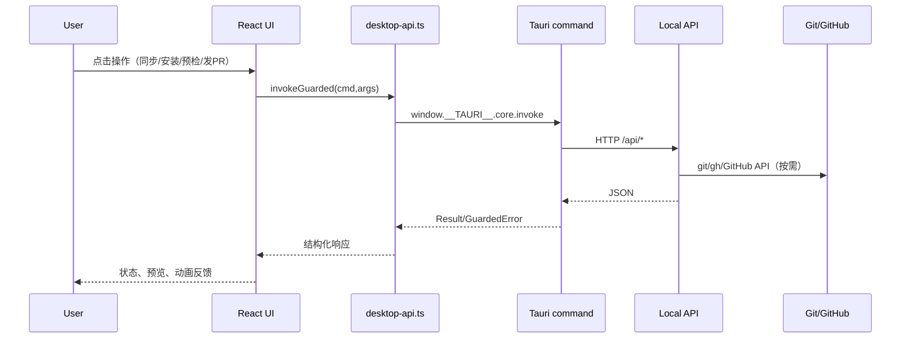

# SkillDock Skill Agent 全局技术方案

## 1. 文档信息

- 文档版本：`v1.0`
- 更新时间：`2026-03-08`
- 适用范围：当前仓库实现（`/src`、`/src-tauri`、`/scripts/dev-local-api.mjs`）

## 2. 背景与目标

### 2.1 背景

项目旨在提供一个桌面端 Skill 管理工作台，覆盖：

- 技能市场浏览与安装
- 本地技能聚合管理（Claude/Codex）
- 单 Skill 发布流程（预检 + 创建 PR）

### 2.2 当前目标

- 在桌面端形成“管理 + 发布”闭环。
- 降低跨 Provider（Claude/Codex）安装和发布操作成本。
- 提升发布操作可见性（预检清单、变更预览、运行中反馈）。

### 2.3 非目标（当前阶段）

- Skill 创造营完整生产能力（当前为占位页）。
- 前端直接访问远端仓库/平台 API（统一经过本地 API 与 Tauri 命令）。
- 完整稳定发布 UI 编排（promote-stable 的服务能力已具备，页面当前未挂载主流程）。

## 3. 总体架构

## 3.1 分层设计

1. 展示层（React）
- 页面与组件：`src/pages/*`、`src/components/*`
- 负责交互编排、状态呈现、国际化文案、UI 动效

2. 桥接层（Desktop API Adapter）
- 文件：`src/lib/desktop-api.ts`
- 统一封装 `invoke` 调用与错误归一化

3. 桌面命令层（Tauri Command）
- 文件：`src-tauri/src/commands/desktop.rs`
- 负责参数校验、超时、错误码映射、系统能力（目录选择）

4. 业务服务层（Local API）
- 文件：`scripts/dev-local-api.mjs`
- 承载市场索引、安装记录、本地扫描、发布 dry-run 与 PR 创建

5. 持久化与外部依赖层
- 本地状态：`.runtime/desktop-stack/local-api/*`
- 本地安装目录：`~/.codex/skills`、`~/.claude/skills`
- 远端：Git 仓库与 GitHub PR API / `gh` CLI

## 3.2 逻辑链路



## 4. 前端模块设计

## 4.1 应用壳层

- 文件：`src/app/app.tsx`
- 主导航 4 个 Tab：
  - 市场
  - 本地 Skill 管理
  - Skill 创造营
  - 发布中心
- 支持中英文切换并持久化到 `localStorage`。

## 4.2 市场页（Market）

- 文件：`src/pages/market-page.tsx`
- 能力：
  - 加载源列表、按源筛选技能
  - 市场索引同步（`sync_market_index`）
  - 技能安装（稳定版优先，无稳定版则 beta）
  - 一键“技能解读”（摘要/场景/关键词/建议）
  - 源管理入口（切换到 `SourceManager`）

## 4.3 仓库源管理（SourceManager）

- 文件：`src/components/source-manager.tsx`
- 能力：
  - 新增、编辑、启用/禁用、删除自定义源
  - HTTPS 与字段合法性校验
  - 可达性探测（HEAD 检查）
  - 展示仓库简介（显式 description 或自动拼装）

## 4.4 本地 Skill 管理

- 文件：`src/pages/local-skills-page.tsx`
- 当前关键实现（已落地）：
  - 数据为 Claude + Codex 安装记录并集聚合
  - Provider 标签状态可视化（高亮/置灰）
  - 单击标签可执行“安装到该 Provider”或“从该 Provider 移除”
  - 支持本地磁盘扫描导入（`.codex/skills`、`.claude/skills`）
  - 支持详情弹层（路径、分支、安装时间等）

## 4.5 发布中心（Single Skill）

- 文件：`src/components/beta-release-panel.tsx`
- 流程：
  - 阶段 1：准备（选择目录 + 版本号 + 自动技能 ID）
  - 阶段 2：预检（dry-run + 清单 + 变更文件 + 摘要）
  - 阶段 3：发布（确认后创建 PR）
- 关键体验：
  - 顶部横向阶段轨道，支持前后切换
  - 支持“浏览文件夹”选择 skill 目录（原生文件选择器）
  - 版本号默认值自动生成：`0.1.0-rc.YYYYMMDD.1`
  - releaseId/requestedBy 后端自动生成
  - “执行预检”与“创建 PR”均有按钮级 loading 动画与禁重入控制

## 5. Tauri 命令与接口契约

## 5.1 命令注册

- 文件：`src-tauri/src/desktop_commands.rs`
- 已注册命令包括：
  - 健康检查、源管理、市场同步与安装
  - 本地技能列表/扫描/Provider 安装/移除
  - 目录选择
  - beta dry-run / beta create-pr / stable create-pr

## 5.2 Tauri -> Local API 路由映射（核心）

- `local_api_health` -> `GET /api/health`
- `list_repo_sources` -> `GET /api/settings/skills/sources`
- `upsert_repo_source` -> `PUT /api/settings/skills/sources`
- `delete_repo_source` -> `DELETE /api/settings/skills/sources`
- `sync_market_index` -> `POST /api/market/sync`
- `get_market_skills` -> `POST /api/market/skills`
- `install_market_skill` -> `POST /api/market/install`
- `list_local_skills` -> `GET /api/local/skills`
- `scan_local_skills_from_disk` -> `POST /api/local/skills/scan`
- `install_local_skill_for_provider` -> `POST /api/local/skills/provider/install`
- `remove_local_skill_record` -> `DELETE /api/local/skills`
- `dry_run_beta_release` -> `POST /api/release/beta/dry-run`（120s 超时）
- `create_beta_release_pr` -> `POST /api/release/beta/create-pr`（120s 超时）
- `create_promote_stable_pr` -> `POST /api/release/stable/create-pr`（120s 超时）

## 5.3 错误模型

前后端统一 `GuardedError`：

- `OFFLINE_BLOCKED`
- `OWNER_ONLY`
- `SUPERVISOR_APPROVAL_REQUIRED`
- `UNREACHABLE_SOURCE`
- `NETWORK_ERROR`
- `VALIDATION_ERROR`
- `UNKNOWN`

状态提示由 `StatusBanner` 统一渲染。

## 6. Local API 核心方案

## 6.1 状态持久化

- 源配置：`.runtime/desktop-stack/local-api/sources.json`
- 安装记录：`.runtime/desktop-stack/local-api/installations.json`

## 6.2 市场索引与安装

- 源写入时执行结构校验与 HTTPS 限制。
- 索引支持按源过滤与健康状态回填。
- 安装会从源仓库获取 Skill 内容，写入：
  - SSOT 目录（默认 `~/.skilldock-skill-agent/skills`）
  - 目标目录（默认 `~/.codex/skills`）

## 6.3 本地技能扫描

- 默认扫描：
  - `~/.codex/skills` -> `local-codex`
  - `~/.claude/skills` -> `local-claude`
- 读取 `SKILL.md` frontmatter，补全记录元数据。

## 6.4 发布预检与创建 PR

### Dry-run

- 校验 `version`、`skillPath`，自动推导 `skillId`。
- 自动生成 `releaseId`：`r-YYYYMMDD-HHMMSS`（若未传入）。
- 检查 `SKILL.md` frontmatter（必须含 `name` + `description`）。
- 构建变更清单、对齐检查项、changelog 摘要。

### Create PR

- 生成分支：`beta-release/{skill}-{version}-{timestamp}`
- 写入/清理目标仓库变更并提交推送
- 创建 PR：
  - 优先 GitHub Token API
  - 否则回退 `gh pr create`
  - 失败时回退 compare URL 并返回 warning

## 7. 发布治理与 CI 机制

## 7.1 审批策略

- `beta-release:*`：要求 supervisor 审批
- `promote-stable:*`：
  - 仅 skill owner 可发起
  - 仍需 supervisor 审批

相关配置：

- `.github/supervisors.json`
- `.github/skill-owners.json`

## 7.2 CI/工作流

- `beta-release-checks.yml`：schema + regression + security 扫描
- `beta-release-approval.yml`：beta 发布审批门禁
- `promote-stable-approval.yml`：stable 晋升 owner/supervisor 双门禁
- `beta-release-post-merge.yml`：合并后更新 beta 指针与审计
- `promote-stable-post-merge.yml`：合并后更新 stable 指针与审计
- `promotion-merge-queue.yml`：发布类 PR 串行化

## 8. 运行与联调方案

## 8.1 推荐方式

```bash
pnpm start:stack
```

该方式将自动：

- 端口占用清理
- 启动本地 API 与桌面端
- 健康检查 + 稳定窗口 + 日志就绪检测

## 8.2 观测点

- PID：`.runtime/desktop-stack/pids/*`
- 日志：`.runtime/desktop-stack/logs/*`
- 健康接口：
  - API：`GET /api/health`
  - 桌面Web：`http://127.0.0.1:1420`

## 8.3 全平台安装包产出

- Tauri 打包已启用：`src-tauri/tauri.conf.json` -> `bundle.active=true`。
- 本机构建：`pnpm tauri:build`（产出当前 OS 安装包）。
- CI 构建：`.github/workflows/desktop-cross-platform-build.yml`
  - 构建矩阵：`macos-13` / `windows-2022` / `ubuntu-22.04`
  - 产物目录：`src-tauri/target/release/bundle/**`
  - 触发：`workflow_dispatch` 与 `v*` tag 推送

## 9. 非功能设计

## 9.1 可用性

- 异步操作统一 loading/error/success banner
- 发布关键操作具备禁重入控制
- 长耗时预检提供按钮动画与内容占位反馈

## 9.2 可维护性

- 页面、组件、桥接、命令、服务分层清晰
- TypeScript + Rust 双侧强类型约束
- 脚本化检查覆盖结构、流程、策略

## 9.3 安全与合规

- 源地址限制 HTTPS
- 离线模式阻断远端发布变更
- 发布 PR 需审批门禁与 owner 约束

## 10. 已知约束与后续演进

## 10.1 现状约束

- Skill 创造营仍是占位页。
- release center 当前主流程聚焦单 Skill 发布；stable 晋升能力主要在后端与 CI 策略层。
- 默认本地 API 为开发实现，生产化需替换为正式服务部署。

## 10.2 演进建议

1. Skill 创造营落地完整生成/校验/预览/提交闭环。
2. 发布中心增加 stable 晋升可视化流程与审计时间线。
3. 引入统一 API OpenAPI 文档与契约测试，减少前后端偏差。
4. 增加 telemetry（发布耗时、失败原因分布、重试率）以支撑运维优化。
